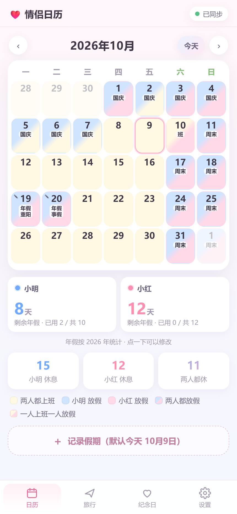

# 情侣日历 · 两个人的假期

一个只属于你们两个人的日历 App：把各自地区的法定假期、自己的年假请假、旅行计划和纪念日
放在同一张日历上，两台手机实时同步。

蓝色 = 用户 1（默认「宝宝」，中国大陆），粉色 = 用户 2（默认「宝贝」，香港）。



## 功能

| # | 需求 | 实现 |
| --- | --- | --- |
| 1 | 真实日历，从 2025-01-01 起 | 月视图，可前后翻月，最早到 2025 年 1 月 |
| 2 | 工作日/周末/两地法定假期不同底色 | 上班＝奶油黄；谁放假就用谁的淡色——用户1 淡蓝、用户2 淡粉；两人颜色不同就显示双色渐变 |
| 3 | 配色适合情侣 App | 蓝 `#6FA8FF` ↔ 粉 `#FF8FB1` 渐变主色，柔和圆角卡片 |
| 4 | 自己选年假/请假，重合显示渐变 | 点日期即可标记「年假/事假/病假/调休/其他」，可一次连续多天，还能写备注；两人同一天都有假就显示双色渐变 |
| 5 | 两台手机 App 形式操作并同步 | PWA（可加到主屏）；本机版用 SSE 实时推送，云端版每 20 秒拉取；断网时本地排队、联网自动补发 |
| 6 | 旅行计划页 | 手机宽度卡片（目的地 / 天数 / 预计经费），点开进子页面：「总体计划」+ Day1、Day2… 分格编辑，底部「＋ 添加一天」 |
| 7 | 纪念日每年特殊标识 | 任意日期设为纪念日，每年同日日历格显示图标；列表显示正数与倒数，详情页是大数字界面；支持自定义图标和拖动排序 |

## 快速开始（本地版）

需要 Node.js 18 或更高版本。**如果电脑没装也没关系**：双击启动脚本时它会自动下载一个便携版
（国内镜像，约 36MB，只下载一次，放在项目里的 `.runtime` 目录）。本项目 **零第三方依赖**，
不需要 `npm install`。

```bash
node server.js
```

Windows 上也可以直接双击 `启动情侣日历.bat`。启动后终端会打印两个地址：

```
本机：   http://localhost:5178
手机访问：http://192.168.1.131:5178   (需与电脑同一 Wi-Fi)
```

## 让两台手机同步

1. 电脑运行 `node server.js`，保持窗口开着（数据存在电脑上的 `data/store.json`）。
2. 两台手机连**同一个 Wi-Fi**，用浏览器打开上面那条「手机访问」地址。
3. 在「设置」页里，各自选择「用户」是谁（一台选蓝色，一台选粉色）。
4. 之后任何一台的修改都会自动出现在另一台上（顶部圆点显示同步状态）。

第一次运行如果弹出 Windows 防火墙提示，请选「允许访问」，否则手机连不上电脑。

### 不在一起的时候怎么办

| 方式 | 怎么用 | 代价 |
| --- | --- | --- |
| **A. 公网隧道**（最快） | 电脑双击 `启动并分享给外网.bat`，会生成带密钥的配对链接，发给对方 | 电脑要开机、分享窗口要开着；地址可能变 |
| **B. 云端部署**（推荐长期用） | 见下面「部署到云端」，朋友/自己各自部署一份 | 免费额度内不花钱（Cloudflare Workers + D1） |
| **C. Tailscale 之类组网** | 电脑和两台手机都装同一个组网工具，用固定内网地址访问 | 每台设备都要装 App |

不管用哪种方式，**都建议用带密钥的配对链接打开**（链接结尾的 `?k=…`）。

公网隧道模式会自动做三件事：

- **阻止电脑自动休眠**（否则电脑一睡，公网地址立刻失效；笔记本合盖仍然会睡）
- **隧道断了自动重连**，并把新的配对链接醒目地打印出来
- **每分钟自检一次**：不通时先看本地服务是不是挂了（挂就重启服务），本地正常才重建隧道

## 部署到云端（Cloudflare Workers）

云端版把数据放在 **Cloudflare D1 数据库**里，电脑关机也能用。免费额度（每天 10 万次请求、
D1 500 万行读取）两个人用绰绰有余，**不需要花钱**。

> 📖 想照着一步一步点，看 **[部署到云端-详细步骤.md](部署到云端-详细步骤.md)**（含每个界面填什么、
> 国内打不开怎么办、以后怎么维护）。

部署方式有两种，选一种即可。**推荐网页版（方式一）**，全程不用装任何软件。

### 方式一：网页一键部署（推荐）

**第 0 步：准备两个免费账号**

1. [github.com](https://github.com) 注册/登录（用来存放代码）
2. [dash.cloudflare.com](https://dash.cloudflare.com/sign-up) 注册/登录（用来运行服务）

**第 1 步：把项目传到你的 GitHub**

1. 打开 github.com，右上角 `+` → **New repository**
2. Repository name 填 `couple-calendar`，选 **Private**（私有，别人看不到），
   不要勾选 "Add a README file"，点 **Create repository**
3. 在新建的仓库页面，点 **uploading an existing file** 链接
4. 打开本项目的文件夹，**把里面的文件全选**（`server.js`、`public`、`src`、`worker`、
   `wrangler.jsonc` 等）一起拖进浏览器上传区
   - 千万别放进去的：`data/store.json`（你们的日历数据）、`data/share.json`（密钥）、
     `.runtime`（便携版 Node）、`tools/bin`（cloudflared）。用 `打包分发包.bat`
     生成的那个 zip 解压后的内容正好是干净的一份，直接拖它最省事
5. 页面底部点 **Commit changes**

**第 2 步：在 Cloudflare 上一键部署**

1. 在浏览器打开这个地址（把用户名换成你的）：

   ```
   https://deploy.workers.cloudflare.com/?url=https://github.com/你的用户名/couple-calendar
   ```

2. 按提示 **登录 Cloudflare** → 授权它读取这个 GitHub 仓库（只读权限）
3. 它会自动读取 `wrangler.jsonc`，并提示你**创建一个 D1 数据库**（名字 `couple-calendar`），
   点确认创建
4. 点 **Deploy**，等 1~2 分钟
5. 完成后它会给你一个地址，形如 `https://couple-calendar.xxxx.workers.dev`

**第 3 步：设置访问密钥（必做）**

不设密钥的话，任何人知道地址就能看到你们的日历。

1. 打开 [dash.cloudflare.com](https://dash.cloudflare.com) → 左侧 **Workers & Pages** → 点你的服务
2. **Settings** → **Variables and Secrets** → **Add**
3. 类型选 **Secret**，Name 填 `ACCESS_KEY`，Value 填一串别人猜不到的字符
   （例如 20 位随机字母数字），保存
4. 保存后 Cloudflare 会自动重新部署一次（等 1 分钟左右）

**第 4 步：两台手机装上**

1. 两台手机都用浏览器打开：

   ```
   https://couple-calendar.xxxx.workers.dev/?k=你刚设置的ACCESS_KEY
   ```

2. **iPhone**：Safari → 分享按钮 → 「添加到主屏幕」
   **Android**：Chrome → 右上角菜单 → 「安装应用 / 添加到主屏幕」
3. 在「设置 → 用户」里各自选一次自己是蓝色还是粉色

**第 5 步：验证一下**

- 在「设置 → 节假日数据 → 检查更新」点一下，应显示「已是最新」
- 在电脑上打开同一个地址，改动两边互相能看到（20 秒内）

### 方式二：命令行部署（需要 Node.js + npm）

```bash
npm install -g wrangler
wrangler login
wrangler d1 create couple-calendar      # 把输出的 database_id 填进 wrangler.jsonc
wrangler secret put ACCESS_KEY          # 输入你们的访问密钥
wrangler deploy
```

### 以后想改代码 / 更新版本

因为 Cloudflare 绑定了你的 GitHub 仓库，**直接在 GitHub 网页上改文件（或重新上传）并提交**，
Cloudflare 会自动重新部署，不用做别的。

### 云端版和本地版的区别

- 数据存 **D1 数据库**，不依赖电脑磁盘，电脑关机也能用
- **没有实时推送**（云端没有常驻进程），改成**每 20 秒自动拉取一次**；对日历完全够用
- **节假日仍然每天自动更新**：Worker 里有个定时任务（cron）会抓取官方数据、合并后写进 D1
- 想自己看一眼：`设置 → 节假日数据` 里的「数据更新于 …」

### 免费额度会不会超

Cloudflare Workers 免费版是**每天 10 万次请求**。按云端版 20 秒拉一次算，
两个人一直开着页面大约每天 5~6 千次请求——**离上限还有 20 倍**。
在 Cloudflare 面板的 Workers 页面能看到实时用量。

## 装到手机上

- **iPhone**：用 Safari 打开地址 → 分享 → 「添加到主屏幕」
- **Android**：用 Chrome 打开地址 → 右上角菜单 → 「安装应用」

装好后是全屏、有图标、离线也能打开界面的 App。

## 怎么用

- **日历**：点任意日期，在弹出的面板里点「年假 / 事假 / 病假 / 调休 / 其他」就能给自己标假；
  同一个类型再点一次取消。面板顶部可选「连续 N 天」，一次标一整段假期。
- **假期备注**：标完假期后，同一张面板里会出现备注输入框，可以写「陪爸妈体检」「婚假」之类，
  停手 0.7 秒自动保存。写备注时切换假期类型不会丢；有备注的日子左下角带一个 ✎ 小标记。
- **剩余年假**：日历下方有两张卡片，分别显示两个人今年还剩多少天年假，点一下就能改。
  你只填「还剩几天」，App 自动结合日历上标成「年假」的天数算出总数。
- **简繁**：香港官方假期名是繁体，日历里已经自动转成简体显示（如「重陽節」→「重阳」）。
- **颜色规则**：每个人每天只有两种状态——上班（黄）或放假（淡蓝/淡粉）。
  两人状态不一样时（比如大陆调休补班的周六、香港照常放假）就是两种颜色的渐变，
  格子里会写清原因（「班」「国庆」「周末」「年假」等）。两人都有假时注释分两行显示。
- **各按各的地区算假期**：按「设置 → 用户设置」里每个人填的法定假期地区查假期，
  不是固定把人 1 当大陆、人 2 当香港。
- **旅行**：点「＋ 新建旅行计划」填目的地、出发日期、天数、预算，进入子页面后
  上方有一块独立的「**总体计划**」（写机票、住宿、想带的东西，文本框会跟着内容自动变高），
  下面每格写一天的安排（同样自动变高），底部「＋ 添加一天」增加天数，改动会自动保存。
- **纪念日**：添加名称、日期、图标（预设 10 个，也可以直接粘贴任意表情）；设成「每年重复」后
  每年这一天日历格都会显示图标。列表里显示**正数**（已过多少天）和**倒数**（还有多少天）；
  点进子页面是 Days Matter 那种大数字界面，点大数字可在正数/倒数之间切换。
  点右上角「**排序**」进入排序模式后，每条左侧出现拖动手柄，按住手柄上下拖即可调整顺序。
- **设置**：改两个人（蓝色 / 粉色）的名字和法定假期地区；
  「节假日数据 / 分享链接 / 同步 / 手机 APP 安装方法 / 数据备份」五个模块默认收起，点一下展开。

> 日期选择用的是 App 自带的日历（不是系统原生控件），避免有些手机「选完月份就结束、选不到日」的问题；
> 点标题还能直接选年和月。日历高度固定，翻月时按钮不会跳。

## 节假日数据

数据在 `public/data/holidays.json`（构建产物），原始数据在 `data/raw/`：

- 中国大陆：国务院办公厅放假通知（含调休上班日），来自
  [NateScarlet/holiday-cn](https://github.com/NateScarlet/holiday-cn)
- 香港：香港政府宪报公众假期，来自 [date.nager.at](https://date.nager.at)

目前已收录：中国大陆 2025、2026；香港 2024-2028。
官方还没公布的年份不会报错，只是那一年只按工作日/周末上色，日历标题会提示「放假安排未公布」。

### 会自动更新

- 本地版：服务端**启动 20 秒后检查一次**，之后**每天检查一次**；只有确实缺数据时才联网拉取
- 云端版：Worker 里有定时任务（cron），每天 03:00 自动检查
- 数据源都配了国内可用的镜像（大陆源用 jsDelivr 加速）
- 想立刻检查：**设置 → 节假日数据 → 检查更新**
- 命令行也可以：`node tools/update-holidays.mjs`（加 `--years 2028` 指定年份）

### 大陆假期「预测版」

大陆的放假安排一般要到前一年 11 月才公布。想提前排明年的假期，在
**设置 → 节假日数据 → 大陆放假安排**里把 **官方公告** 切成 **预测版**：

- 推算规则：春节按除夕起 8 天、国庆 10/1 起 7 天、劳动节 5/1 起 5 天，其余按节日当日；不含调休上班日
- 农历日期取自香港的公众假期日期（香港会提前公布）
- 预测出来的日子在日历上带**虚线边框**，点开也会标注「预测，非官方」

## 数据与备份

- 本地版数据在 `data/store.json`；云端版在 Cloudflare D1 数据库里
- 「设置 → 数据备份 → 导出备份 JSON」可以随时导出一份快照
- 删掉 `data/store.json` 等于清空本地版所有记录

## 分发给朋友（不带上你们的数据）

双击 `打包分发包.bat`，会生成 `分发包/情侣日历-分发包-日期.zip`。它会自动排除：

| 排除内容 | 原因 |
| --- | --- |
| `data/store.json` | **你们的全部数据** |
| `data/share.json` | 公网访问密钥 |
| `.runtime/`、`tools/bin/` | 便携版 Node、cloudflared（朋友机器上会自动下载） |
| 日志、`.shots/` 临时截图 | 调试产生的临时文件 |

朋友拿到压缩包后，解压 → 双击「启动情侣日历.bat」即可本地使用；
或者按上面的「部署到云端」步骤部署到**他们自己的** Cloudflare，数据完全独立、你碰不到。

## 常见问题

**打开页面只有底部四个图标，中间是空的？**

说明你打开的是磁盘上的 `public/index.html`（浏览器地址栏以 `file://` 开头）。
浏览器不允许这种本地文件方式加载 App，必须通过服务访问：先启动 `node server.js`
（或双击 `启动情侣日历.bat`），再打开 `http://localhost:5178`。

**更新了软件之后，手机上要重新生成链接吗？**

不用。链接只是「服务器的地址」，刷新页面就能看到新版本。
只有两种情况要重新发链接：电脑上的分享窗口关掉重开了（公网地址会变），或者换了端口。

**手机上刷新了还是旧样子？**

App 有离线缓存，现在改成了「有网就优先取最新文件」，正常刷新一次即可。
如果还看到旧界面，下拉刷新或关掉标签重开一次。

**公网链接过一段时间就「打不开该网页」了？**

公网地址依赖三个条件：电脑开着没睡、分享窗口没关、Cloudflare 隧道在线。
最常见的是**电脑自动休眠**，其次是窗口被关、断网，以及免费隧道本身会被周期性回收。
脚本现在会自动重连并阻止休眠；重连后地址会变，窗口里会醒目提示「公网地址变了」。
想要稳定的地址就上云端部署。

**窗口里一直显示「公网隧道断开…重连」怎么办？**

先看窗口里 `[cloudflared]` 开头的那行报错：

- `x509: certificate signed by unknown authority`：说明当前网络对 `trycloudflare.com`
  的解析被干扰（返回伪造 IP，证书自然不可信）。这种干扰时好时坏，所以会出现
  「前几天能用、今天连不上」。解决办法：双击 **`修复隧道DNS.bat`**，
  它会把 `api.trycloudflare.com` 固定到真实的 Cloudflare IP（只加一行，随时可删；
  修改前会自动备份 `hosts.ccbak`）
- `context deadline exceeded` / 连接超时：多半是当前网络屏蔽了 Cloudflare

脚本会自动依次尝试「直连 → 直连+HTTP/2 → 代理 → 代理+HTTP/2」四种方式；
连续 6 次重建都不通时会停止死循环并给出提示。

**端口被占用？**

`PORT=5199 node server.js` 可以换端口，手机访问时也换成对应端口。

## 目录结构

```
server.js                 本地版 HTTP 服务：静态资源 + 同步 API + SSE（仅用 Node 内置模块）
src/store.js              本地版存储（JSON 文件）
src/ops-core.js           纯逻辑：默认状态 + 操作应用（本地版和云端版共用）
src/holiday-merge.js      纯逻辑：节假日合并 / 预测（两边共用）
src/holiday-data.js       本地版：读 data/raw 生成前端数据
src/update-holidays.js    本地版：自动抓取并更新节假日
src/share.js              公网分享 / 访问密钥
worker/index.js           Cloudflare Workers 版后端（云端部署用）
wrangler.jsonc            Cloudflare 部署配置（D1 绑定 + 每日定时任务）
public/
  index.html              页面骨架
  css/styles.css          全部样式（含颜色语义变量）
  js/
    app.js                路由、顶栏、全局刷新
    sync.js               与服务端同步（乐观更新 + 离线队列 + SSE/轮询）
    ops.js                客户端操作应用逻辑（与服务端一致）
    diff.js               对比两份状态，生成「TA 刚更新了…」提示
    holidays.js           节假日查询
    datepicker.js         自带的日期选择器（可点标题选年/月）
    util.js               日期 / DOM 工具
    ui.js                 底部弹层（可堆叠）、轻提示、确认框
    views/                日历、旅行、纪念日、设置
  data/holidays.json      节假日数据（生成物）
  manifest.webmanifest    PWA 清单
  sw.js                   Service Worker（有网取最新、断网用缓存）
data/
  raw/                    官方节假日原始数据
  store.json              你的数据（本地版，自动生成）
tools/
  build-holidays.mjs      合并生成 public/data/holidays.json
  build-predictions.mjs   生成大陆假期预测版
  update-holidays.mjs     抓取并更新节假日数据
  make-icons.mjs          生成 App 图标 PNG
  make-package.mjs        打包「只含软件」的 zip
  share.mjs               公网隧道 + 配对链接
  fix-tunnel-dns.ps1      绕过 api.trycloudflare.com 的 DNS 污染
  launch.ps1              启动器（自动找/下载 Node.js）
  test-worker.mjs         本地测试 Cloudflare Worker（模拟 D1）
  devshot.mjs / devpng.mjs 开发用的截图 / 像素检查工具
Dockerfile / render.yaml  其它云端部署方式（跑的就是本地版代码）
```

## 同步 API（想自己扩展时用）

- `GET /api/meta` — 服务端能力（是否支持 SSE 实时推送等）
- `GET /api/state` — 读取全量状态（带 `?rev=` 时没变化会返回 `{unchanged:true}`）
- `GET /api/events` — SSE 实时推送（本地版；云端版返回 501，前端自动改轮询）
- `POST /api/op` — 提交操作，body 形如 `{ "ops": [ { "kind": "leave.set", ... } ] }`
- `GET /api/holidays.json` / `/api/holidays/predict.json` — 节假日数据
- `POST /api/holidays/update` — 立即检查更新

支持的 `kind`：`leave.set` / `leave.remove` / `trip.create` / `trip.update` / `trip.delete`
/ `anniv.create` / `anniv.update` / `anniv.delete` / `anniv.reorder` / `member.update` / `settings.update`。

创建类操作是幂等的（按 id 去重），所以网络重试不会产生重复记录。

## 开发者：测试

```bash
node tools/test-worker.mjs        # 云端版接口测试（模拟 D1，不需要 wrangler）
node tools/build-holidays.mjs     # 重新生成节假日数据
```
